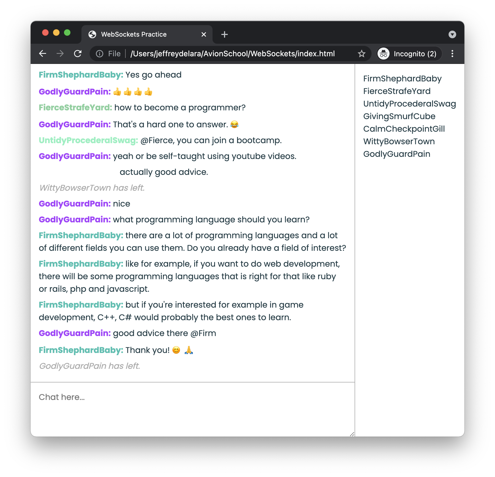

# Simple Chat Using WebSockets

I got curious on how real time web apps work. So I did a couple of reading about WebSockets. Using the knowledge learned, I created a small chat app using javascript and node with WebSocket.

## How to Use WebSocket

On the server:

    const WebSocket = require('ws');
    const wss = WebSocket.Server({port: 8888});

    // listen for connection
    wss.on('connection', ws => {

        // To send a message to a client
        ws.send('message here');

        // listen for message
        ws.on('message', (data) => {
            // data contains the message from the clients
        });

        // listen for closing of connection
        ws.on('close', () => {

        });
    })

On the client: 
    
    const ws = new WebSocket('ws://localhost:88888')'

    // to send message to server
    ws.send('message here');

    // listen for open connection with the server
    ws.addEventListener('open', () => {
        console.log('Connected');
    });

    // add event listener to listen for message
    ws.addEventListener('message', (data) => {

    });

## How to Run this Program

After cloning repo, go to the `/server` folder. 
Then type:

`node index.js`

^ this willl start the server.

Once its running, visit `index.html` page. You can now chat.